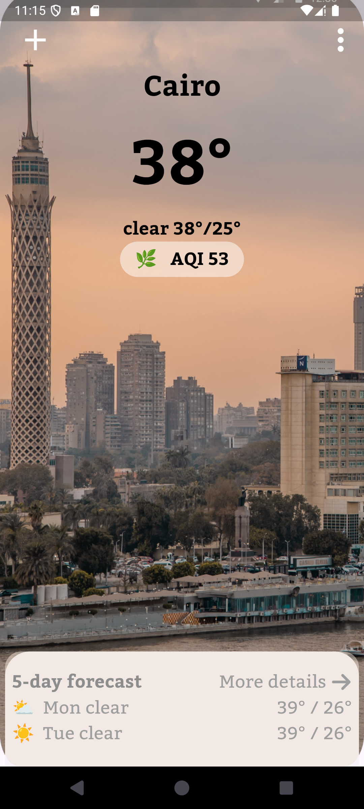

Weather App 🌤️

A Flutter project that provides up-to-date weather information with a clean and intuitive interface.

Overview
This application is designed to help users check the weather in multiple cities with ease. The user-friendly interface and smooth transitions enhance the user experience.

Figma Design 🎨
Explore the design of the app on Figma:
https://www.figma.com/design/8QSR3i2EG6ja0Kle7FqW6h/weather-app-(Community)?node-id=0-1&t=MhjkF3ijp1SpnnnW-0


Memory updated
To make your README file more professional, I'll structure it with clear sections, add brief explanations, and ensure consistency. Here's a refined version:

Weather App 🌤️
A Flutter project that provides up-to-date weather information with a clean and intuitive interface.

Overview
This application is designed to help users check the weather in multiple cities with ease. The user-friendly interface and smooth transitions enhance the user experience.

Figma Design 🎨
Explore the design of the app on Figma:

Weather App Figma Design

Screenshots
Welcome Screen
This is the introductory screen that welcomes users to the Weather App.

Welcome Screen
This is the introductory screen that welcomes users to the Weather App.


Locations Home Screen
Displays the weather information for multiple locations, allowing users to easily check different cities.


Cairo Weather
Detailed weather information for Cairo, including temperature and air quality index (AQI).



Alexandria Weather
Detailed weather information for Alexandria.


Tokyo Weather
Detailed weather information for Tokyo.


Features
Real-Time Weather Updates: Stay updated with the latest weather conditions.
Multi-City Support: Easily switch between different cities.
Intuitive Interface: Simple and user-friendly design for seamless interaction.
Getting Started
This project serves as a starting point for a Flutter application. Follow the resources below to dive into Flutter development:

Lab: https://docs.flutter.dev/get-started/codelab

CookBook: https://docs.flutter.dev/cookbook

For additional guidance and API references, visit the Flutter online documentation ➡️ https://docs.flutter.dev/

How to Run
1. Clone the repository:
git clone  https://github.com/omarAbdullahMoharam/ITI-Summer-Intern/tree/main/Flutter/weather_app
2. Navigate to the project directory:
```console
cd weather_app
```
3. Get dependencies:
```console
flutter pub get
```
4. Run the app on your preferred device or emulator:
```console
flutter run
```
Contributing
Contributions are welcome! If you have ideas or improvements, feel free to fork the repository and submit a pull request.


